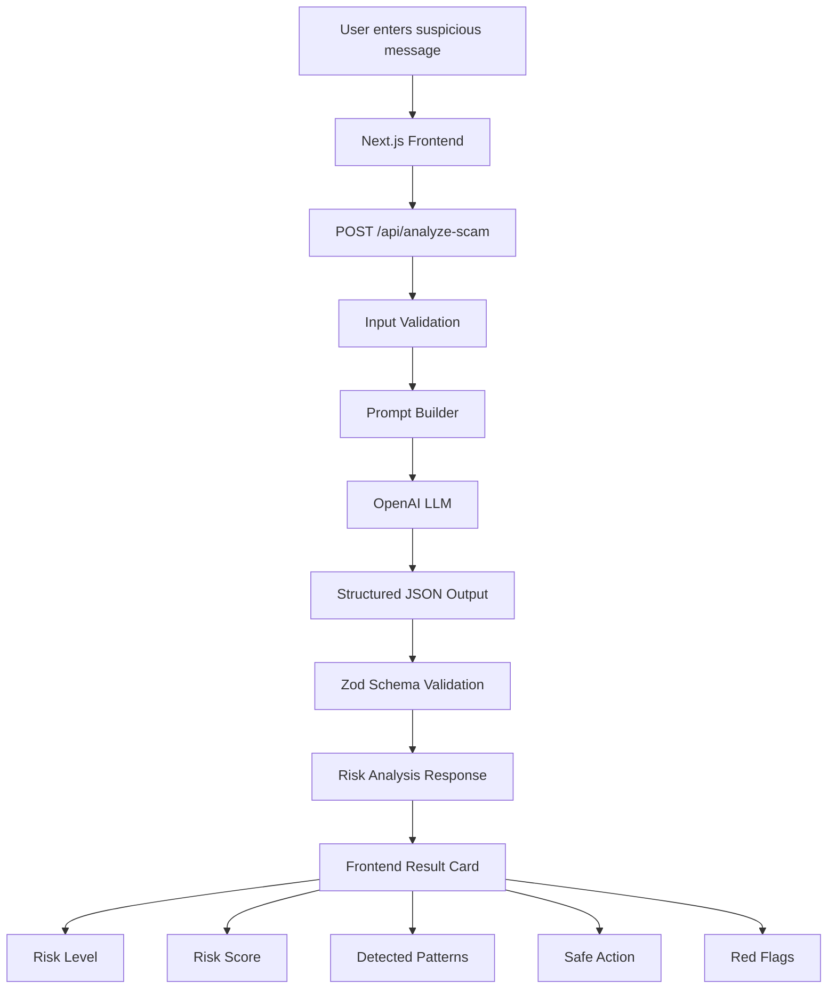
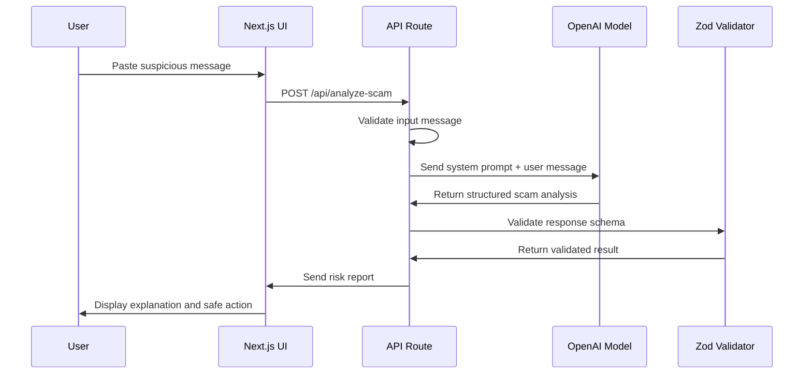
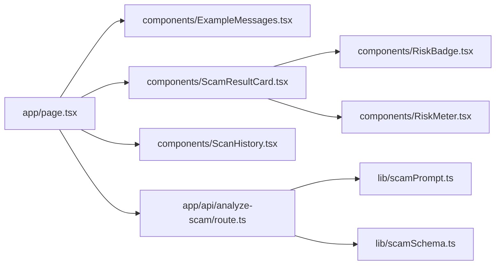
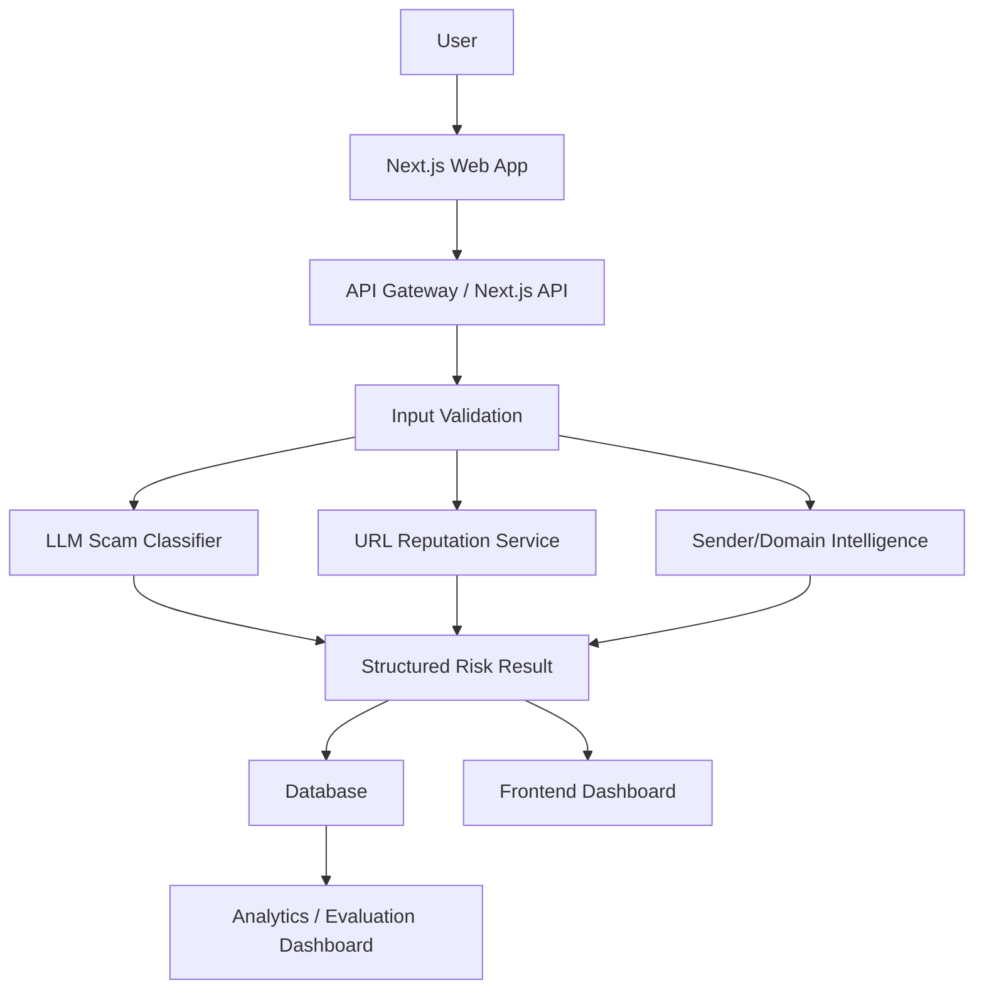

# AI-Powered Scam Detection System

A production-style GenAI application that analyzes SMS, email, and chat messages to detect **scam**, **phishing**, **spam**, and **social engineering** risk.

The system uses an LLM with **structured output**, **Zod schema validation**, **risk scoring**, **fraud pattern detection**, and a clean **Next.js UI** to help users understand whether a message is safe or suspicious.


## 1. Project Summary

Scam and phishing messages are becoming more realistic. Attackers often use:

- Fake bank or delivery messages
- Urgent KYC update requests
- OTP/password stealing
- Fake prize or lottery claims
- Gift card scams
- Emotional manipulation
- Suspicious links
- Fake authority or impersonation

This project solves that problem by allowing a user to paste a suspicious message and receive a structured AI-generated risk report.

The application does not simply return a generic AI paragraph. It returns a validated JSON response with:

- Risk level
- Scam category
- Confidence score
- Risk score
- Detected fraud patterns
- Human-friendly explanation
- Safe action recommendation
- Red flags

---

## 2. Why This Project Matters

Most basic AI projects are simple wrappers around an LLM.

This project demonstrates a more realistic GenAI engineering approach:

| Area               | Implementation                                                           |
| ------------------ | ------------------------------------------------------------------------ |
| LLM classification | Classifies messages as safe, phishing, scam, spam, or social engineering |
| Structured output  | AI response follows a strict JSON schema                                 |
| Validation         | Zod validates the AI output before sending it to the UI                  |
| Explainability     | User can see why the message is risky                                    |
| Risk scoring       | Converts qualitative analysis into a numeric score                       |
| Evaluation         | Test dataset validates system behavior                                   |
| Product UI         | Clean dashboard-style user experience                                    |

---

## 3. Demo Use Case

### Example Input

```text
Your SBI account will be blocked today. Click here to update your KYC immediately:
http://sbi-verify-login.fake
```

### Example Output

```json
{
  "riskLevel": "CRITICAL",
  "category": "PHISHING",
  "confidence": 0.96,
  "riskScore": 92,
  "summary": "This message is very likely a phishing attempt.",
  "detectedPatterns": [
    {
      "pattern": "URGENCY",
      "evidence": "The message says the account will be blocked today."
    },
    {
      "pattern": "SUSPICIOUS_LINK",
      "evidence": "The link does not look like an official SBI domain."
    }
  ],
  "reasons": [
    "It creates fear by saying your bank account will be blocked.",
    "It asks you to click a suspicious link.",
    "It imitates a bank KYC process."
  ],
  "safeAction": "Do not click the link. Open the official bank app or website directly.",
  "redFlags": ["Urgency", "Bank impersonation", "Suspicious link", "KYC fraud"],
  "userFriendlyExplanation": "This message tries to scare you into clicking a fake bank link."
}
```

---

## 4. Core Features

### AI Features

- Detects scam messages
- Detects phishing attempts
- Detects social engineering
- Detects spam-like content
- Detects suspicious links
- Detects OTP/password/bank detail requests
- Detects urgency and fear tactics
- Explains risk in simple language
- Suggests safe next steps

### Engineering Features

- Next.js App Router
- TypeScript
- OpenAI API integration
- Structured AI output
- Zod schema validation
- Backend API route
- Frontend risk dashboard
- Reusable React components
- Test dataset
- Custom evaluation script

---

## 5. Tech Stack

| Layer           | Technology                 |
| --------------- | -------------------------- |
| Frontend        | Next.js, React             |
| Language        | TypeScript                 |
| Styling         | Tailwind CSS               |
| Backend         | Next.js API Route          |
| AI Provider     | OpenAI API                 |
| Validation      | Zod                        |
| Testing         | Node.js custom test script |
| Package Manager | npm                        |

---

## 6. High-Level Architecture



---

## 7. AI Analysis Flow



---

## 8. Component Architecture



---

## 9. Folder Structure

```text
ai-scam-detector/
  app/
    api/
      analyze-scam/
        route.ts
    globals.css
    layout.tsx
    page.tsx

  components/
    ExampleMessages.tsx
    RiskBadge.tsx
    RiskMeter.tsx
    ScamResultCard.tsx
    ScanHistory.tsx

  data/
    test-cases.json

  lib/
    scamPrompt.ts
    scamSchema.ts

  scripts/
    test-scam-detector.mjs

  public/

  .env.example
  .gitignore
  README.md
  eslint.config.mjs
  next.config.ts
  package.json
  package-lock.json
  postcss.config.mjs
  tsconfig.json
```

---

## 10. Important Files Explained

| File                             | Purpose                               |
| -------------------------------- | ------------------------------------- |
| `app/page.tsx`                   | Main frontend page                    |
| `app/api/analyze-scam/route.ts`  | Backend API route for scam analysis   |
| `components/ScamResultCard.tsx`  | Displays AI risk report               |
| `components/RiskBadge.tsx`       | Shows LOW/MEDIUM/HIGH/CRITICAL badge  |
| `components/RiskMeter.tsx`       | Shows numeric risk score visually     |
| `components/ExampleMessages.tsx` | Provides quick test examples          |
| `components/ScanHistory.tsx`     | Shows recent scans in browser session |
| `lib/scamPrompt.ts`              | System prompt and user prompt builder |
| `lib/scamSchema.ts`              | Zod schema for structured AI output   |
| `data/test-cases.json`           | Evaluation dataset                    |
| `scripts/test-scam-detector.mjs` | Test runner script                    |

---

## 11. How the System Works

### Step 1: User Enters a Message

The user pastes a suspicious message into the frontend.

Example:

```text
Congratulations! You won ₹10,00,000. Pay ₹999 processing fee to claim your reward.
```

---

### Step 2: Frontend Calls API

The frontend sends a request to:

```text
POST /api/analyze-scam
```

Request body:

```json
{
  "message": "Congratulations! You won ₹10,00,000. Pay ₹999 processing fee to claim your reward."
}
```

---

### Step 3: Backend Validates Input

The API checks:

- Message exists
- Message is a string
- Message is not too short
- Message is not too long

This prevents bad input from reaching the AI model.

---

### Step 4: Prompt Is Built

The backend sends the model:

1. A system prompt that defines the AI's role
2. A user prompt containing the message to analyze

The model is instructed to detect:

- Phishing
- Scam
- Spam
- Social engineering
- Urgency
- Fear
- Suspicious links
- Sensitive information requests
- Payment pressure
- Impersonation

---

### Step 5: AI Returns Structured Output

The AI returns a structured response containing:

- `riskLevel`
- `category`
- `confidence`
- `riskScore`
- `summary`
- `detectedPatterns`
- `reasons`
- `safeAction`
- `redFlags`
- `userFriendlyExplanation`

---

### Step 6: Zod Validates the AI Output

The response is validated using Zod.

This ensures the frontend receives predictable data.

If the AI response does not match the expected schema, the API rejects it instead of showing broken data.

---

### Step 7: UI Displays the Result

The UI displays:

- Risk badge
- Risk meter
- Scam category
- Summary
- Detected patterns
- Safe action
- Red flags
- Copy JSON button
- Recent scan history

---

## 12. Scam Categories

| Category             | Meaning                                         | Example                            |
| -------------------- | ----------------------------------------------- | ---------------------------------- |
| `SAFE`               | Normal message                                  | “Are we meeting at 4 PM?”          |
| `SPAM`               | Unwanted promotional message                    | “Buy now, 90% discount!”           |
| `PHISHING`           | Attempts to steal credentials or sensitive data | Fake bank login link               |
| `SCAM`               | Fraudulent attempt to steal money or data       | Fake lottery prize                 |
| `SOCIAL_ENGINEERING` | Manipulation using trust, urgency, or authority | Fake manager asking for gift cards |
| `UNKNOWN`            | Not enough information to classify              | Ambiguous message                  |

---

## 13. Risk Levels

| Risk Level | Meaning                                         |
| ---------- | ----------------------------------------------- |
| `LOW`      | Message appears mostly safe                     |
| `MEDIUM`   | Some suspicious signals are present             |
| `HIGH`     | Strong scam or phishing indicators              |
| `CRITICAL` | Very high-risk message, likely scam or phishing |

---

## 14. Detected Scam Patterns

The AI checks for these patterns:

| Pattern                   | Meaning                                                 |
| ------------------------- | ------------------------------------------------------- |
| `URGENCY`                 | Pressures user to act quickly                           |
| `FEAR`                    | Threatens account block, legal action, or penalty       |
| `FAKE_REWARD`             | Claims user won money, prize, or gift                   |
| `AUTHORITY_IMPERSONATION` | Pretends to be bank, government, company, manager, etc. |
| `SENSITIVE_INFO_REQUEST`  | Requests OTP, password, Aadhaar, card, or bank details  |
| `SUSPICIOUS_LINK`         | Contains suspicious or fake URL                         |
| `PAYMENT_PRESSURE`        | Asks user to pay fee, tax, or processing charge         |
| `EMOTIONAL_MANIPULATION`  | Uses emotional pressure to get money or action          |
| `UNUSUAL_SENDER`          | Message context or sender behavior looks abnormal       |
| `NONE`                    | No major scam pattern detected                          |

---

## 15. API Contract

### Endpoint

```http
POST /api/analyze-scam
```

### Request

```json
{
  "message": "Your account will be blocked. Click this link to verify KYC."
}
```

### Success Response

```json
{
  "riskLevel": "HIGH",
  "category": "PHISHING",
  "confidence": 0.92,
  "riskScore": 85,
  "summary": "This message looks like a phishing attempt.",
  "detectedPatterns": [
    {
      "pattern": "URGENCY",
      "evidence": "The message says the account will be blocked."
    }
  ],
  "reasons": [
    "It creates urgency.",
    "It asks the user to click a suspicious link."
  ],
  "safeAction": "Do not click the link. Open the official website directly.",
  "redFlags": ["Urgency", "Suspicious link"],
  "userFriendlyExplanation": "The message tries to scare you into clicking a suspicious link."
}
```

### Error Response

```json
{
  "error": "Message is required"
}
```

---

## 16. Zod Response Schema

```ts
export const DetectedPatternSchema = z.object({
  pattern: z.enum([
    'URGENCY',
    'FEAR',
    'FAKE_REWARD',
    'AUTHORITY_IMPERSONATION',
    'SENSITIVE_INFO_REQUEST',
    'SUSPICIOUS_LINK',
    'PAYMENT_PRESSURE',
    'EMOTIONAL_MANIPULATION',
    'UNUSUAL_SENDER',
    'NONE',
  ]),
  evidence: z.string(),
})

export const ScamAnalysisSchema = z.object({
  riskLevel: z.enum(['LOW', 'MEDIUM', 'HIGH', 'CRITICAL']),
  category: z.enum([
    'SAFE',
    'SPAM',
    'PHISHING',
    'SCAM',
    'SOCIAL_ENGINEERING',
    'UNKNOWN',
  ]),
  confidence: z.number().min(0).max(1),
  riskScore: z.number().min(0).max(100),
  summary: z.string(),
  detectedPatterns: z.array(DetectedPatternSchema),
  reasons: z.array(z.string()).min(1),
  safeAction: z.string(),
  redFlags: z.array(z.string()),
  userFriendlyExplanation: z.string(),
})
```

---

## 17. Evaluation Strategy

LLM outputs may vary slightly because multiple labels can be valid for the same scam.

For example:

| Message Type          | Valid Categories             |
| --------------------- | ---------------------------- |
| OTP stealing          | `PHISHING`, `SCAM`           |
| Gift card fraud       | `SOCIAL_ENGINEERING`, `SCAM` |
| Fake delivery payment | `PHISHING`, `SCAM`           |
| Fake prize            | `SCAM`                       |
| Normal message        | `SAFE`                       |

Because of this, the evaluation script supports:

- Risk level tolerance
- Acceptable category groups

This makes testing more realistic for GenAI systems.

---

## 18. Test Dataset

The dataset includes examples such as:

| Test Case             | Message Type           | Expected Behaviour             |
| --------------------- | ---------------------- | ------------------------------ |
| `bank-phishing-1`     | Fake bank KYC link     | Detect phishing/scam           |
| `safe-meeting-1`      | Normal meeting message | Detect safe                    |
| `fake-prize-1`        | Fake reward scam       | Detect scam                    |
| `delivery-phishing-1` | Fake delivery payment  | Detect phishing/scam           |
| `manager-gift-card-1` | Gift card fraud        | Detect social engineering/scam |
| `safe-family-1`       | Normal family message  | Detect safe                    |
| `otp-request-1`       | OTP stealing           | Detect phishing/scam           |

---

## 19. Getting Started

### Prerequisites

You need:

- Node.js 18 or above
- npm
- OpenAI API key

---

### 1. Clone the Repository

```bash
git clone https://github.com/devJam2026/ai-scam-detector.git
cd ai-scam-detector
```

---

### 2. Install Dependencies

```bash
npm install
```

---

### 3. Create Environment File

```bash
cp .env.example .env.local
```

For Windows PowerShell:

```powershell
Copy-Item .env.example .env.local
```

---

### 4. Add API Key

Inside `.env.local`:

```env
OPENAI_API_KEY=your_openai_api_key_here
```

---

### 5. Run the Application

```bash
npm run dev
```

Open:

```text
http://localhost:3000
```

---

## 20. Running Evaluation Tests

Start the application:

```bash
npm run dev
```

Open another terminal:

```bash
npm run test:scam
```

Expected output:

```text
✅ bank-phishing-1
✅ safe-meeting-1
✅ fake-prize-1
✅ delivery-phishing-1
✅ manager-gift-card-1
✅ safe-family-1
✅ otp-request-1

Test Summary
------------
Passed: 7
Failed: 0
Total: 7
```

---

## 21. Available Scripts

| Script              | Purpose                             |
| ------------------- | ----------------------------------- |
| `npm run dev`       | Starts local development server     |
| `npm run build`     | Builds production version           |
| `npm run start`     | Starts production server            |
| `npm run lint`      | Runs linting                        |
| `npm run test:scam` | Runs scam detector evaluation tests |

---

## 22. UI Screens

The app contains:

### Input Section

User can paste suspicious messages.

### Example Message Section

Users can quickly test common scam scenarios.

### Result Card

Shows:

- Risk level
- Risk score
- Confidence
- Scam category
- Summary
- User-friendly explanation
- Detected patterns
- Safe action
- Red flags

### Scan History

Shows recent scans during the current browser session.

---

## 23. Example Messages to Try

### Bank Phishing

```text
Your SBI account will be blocked today. Click here to update your KYC immediately:
http://sbi-verify-login.fake
```

### Fake Prize Scam

```text
Congratulations! You won ₹10,00,000. Pay ₹999 processing fee to claim your reward.
```

### Gift Card Social Engineering

```text
I am your manager. I am in a meeting. Buy Amazon gift cards immediately and send me the codes.
```

### OTP Stealing

```text
I am calling from bank support. Share the OTP you just received to stop your card from being blocked.
```

### Safe Message

```text
Hi, are we still meeting at 4 PM today?
```

---

## 24. What I Learned from This Project

This project demonstrates the following GenAI engineering skills:

### Prompt Engineering

Designed system and user prompts to guide scam classification.

### Structured Output

Used structured response design so the AI returns predictable JSON.

### Schema Validation

Used Zod to validate AI output before showing it in the frontend.

### LLM Classification

Classified messages into scam, phishing, spam, social engineering, and safe categories.

### Explainable AI

Generated reasons, detected patterns, and safe actions instead of only returning a label.

### Evaluation Mindset

Created test cases and a test runner to validate AI behavior.

### Product Thinking

Designed the app as a usable tool with examples, history, risk meter, and clear explanation.

---

## 25. How to Explain This Project in an Interview

A good explanation:

> I built an AI-powered scam detection system using Next.js, TypeScript, OpenAI, and Zod. The user can paste an SMS, email, or chat message, and the system classifies it into categories like scam, phishing, spam, social engineering, or safe. The important part is that I did not rely on free-form LLM output. I used structured output and Zod validation so the backend only returns predictable, validated JSON to the frontend. The UI shows risk level, risk score, confidence, detected scam patterns, red flags, and safe actions. I also added a small evaluation dataset and a custom test runner to validate the model behavior.

---

## 26. Why This Is Not Just a ChatGPT Wrapper

This project includes:

- Input validation
- Prompt design
- Structured output
- Schema validation
- Typed API response
- Risk scoring
- Explainability
- UI components
- Test dataset
- Evaluation script

A simple wrapper sends text to an LLM and prints the response.

This project builds a controlled GenAI workflow around the LLM.

---

## 27. Limitations

This application has some limitations:

- It depends on the quality of the LLM response
- It does not currently verify URLs using external threat intelligence APIs
- It does not check sender identity
- It does not store long-term history
- It does not support file/email upload yet
- It should not be used as the only source of cybersecurity decision-making

---

## 28. Future Improvements

Possible next versions:

- Add authentication
- Store scan history in a database
- Add URL reputation checking
- Add domain age lookup
- Add email header analysis
- Add screenshot/image scam detection
- Add multilingual support
- Add browser extension
- Add WhatsApp export analysis

---

## 29. Possible Production Architecture



---

## 30. Disclaimer

This tool is for educational and awareness purposes.

It should not be treated as legal, financial, or professional cybersecurity advice. Users should verify suspicious messages through official channels before taking action.

---
