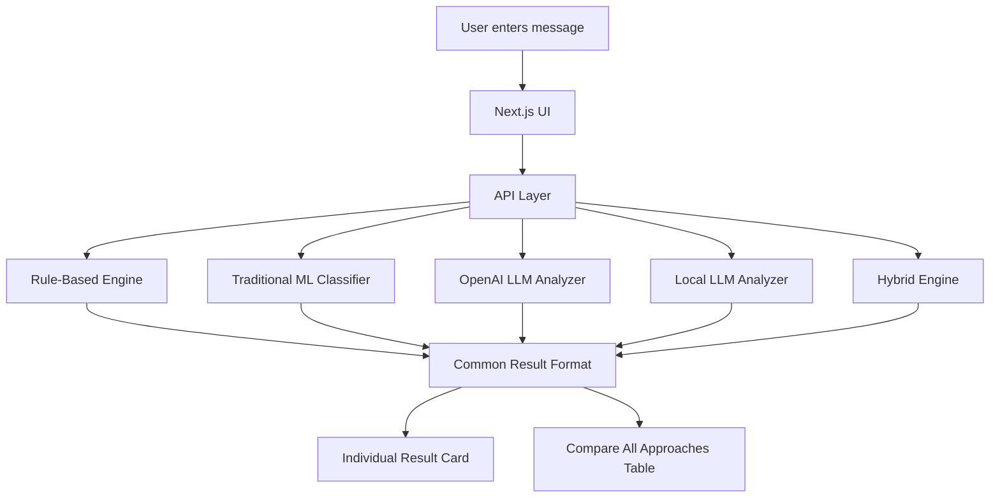

# AI Scam Detector

An educational multi-engine scam detection project built to compare different ways of detecting scam, phishing, spam, and social engineering messages.

https://github.com/user-attachments/assets/ff6752e2-70d3-4b9d-a81e-43508d6ba579

This project is not just an OpenAI wrapper.
It compares multiple approaches for the same problem:

- Rule-Based Detection
- Traditional ML Classifier
- OpenAI LLM
- Local LLM with Ollama
- Hybrid Engine

> This is a learning project. Do not use it as a production fraud detection system.

---

## What It Does

Paste a suspicious SMS, email, WhatsApp-style message, or chat text.

The system returns:

- Risk level
- Risk score
- Confidence
- Scam type
- Red flags
- Explanation
- Safe action
- Cost / latency / infra comparison

Example:

```txt
Your bank account will be blocked today. Click this link immediately to update your KYC.
```

Expected result:

```txt
Risk Level: High
Scam Type: KYC Phishing
Red Flags: Urgency, account threat, KYC update, suspicious link
Safe Action: Do not click the link. Verify directly through official channels.
```

---

## Why This Project?

The goal is to understand how different AI and non-AI approaches behave for the same security problem.

| Approach       | Main Idea                                             |
| -------------- | ----------------------------------------------------- |
| Rule-Based     | Detect known scam signals using deterministic rules   |
| Traditional ML | Train a classifier using labelled scam/safe messages  |
| OpenAI LLM     | Use hosted LLM reasoning and explanation              |
| Local LLM      | Run an open-source model locally through Ollama       |
| Hybrid         | Combine rules, LLM reasoning, validation, and scoring |

---

## Architecture



---

## Supported Approaches

| Approach       |       Cost | Speed       | Infra            | Explainability | Best For                  |
| -------------- | ---------: | ----------- | ---------------- | -------------- | ------------------------- |
| Rule-Based     |         ₹0 | Very Fast   | Very Low         | High           | Known scam patterns       |
| Traditional ML |         ₹0 | Fast        | Low              | Medium         | Low-cost classification   |
| OpenAI LLM     |   API Cost | Medium      | Very Low locally | Very High      | Reasoning and explanation |
| Local LLM      |     ₹0 API | Medium/Slow | Medium           | High           | Privacy and local control |
| Hybrid         | Controlled | Medium      | Medium           | Very High      | Production-style balance  |

---

## Project Structure

```txt
ai-scam-detector/
├── docs/
│   ├── 00-rule-based-approach.md
│   ├── 01-openai-llm-approach.md
│   ├── 02-traditional-ml-approach.md
│   ├── 03-local-llm-approach.md
│   ├── 04-hybrid-approach.md
│   ├── cost-infra-comparison.md
│   └── evaluation-results.md
├── scripts/
│   ├── train-ml-classifier.py
│   └── predict-ml-classifier.py
├── src/
│   ├── app/
│   ├── datasets/
│   │   └── sample-scam-messages.csv
│   ├── models/
│   │   └── scam-classifier.pkl
│   └── services/
│       ├── rule-based-analyzer/
│       ├── ml-classifier/
│       ├── openai-llm-analyzer/
│       ├── local-llm-analyzer/
│       └── hybrid-engine/
```

---

## Getting Started

### 1. Clone the repository

```bash
git clone https://github.com/devJam2026/ai-scam-detector.git
cd ai-scam-detector
```

### 2. Install dependencies

```bash
npm install
```

### 3. Create environment file

```bash
cp .env.example .env.local
```

Windows PowerShell:

```powershell
Copy-Item .env.example .env.local
```

### 4. Update `.env.local`

```env
OPENAI_API_KEY=your_openai_api_key

OLLAMA_BASE_URL=http://localhost:11434
OLLAMA_MODEL=llama3.2

PYTHON_PATH=python
```

For Windows, if needed:

```env
PYTHON_PATH=py
```

### 5. Run the app

```bash
npm run dev
```

Open:

```txt
http://localhost:3000
```

---

## Running Each Approach

### Rule-Based

No extra setup required.

```bash
npm run dev
```

Select:

```txt
Rule-Based
```

---

### OpenAI LLM

Requires:

```env
OPENAI_API_KEY=your_openai_api_key
```

Run:

```bash
npm run dev
```

Select:

```txt
OpenAI LLM
```

---

### Local LLM

Requires Ollama.

Install Ollama:

```txt
https://ollama.com
```

Pull model:

```bash
ollama pull llama3.2
```

Start Ollama if needed:

```bash
ollama serve
```

Run app:

```bash
npm run dev
```

Select:

```txt
Local LLM
```

---

### Traditional ML

Install Python dependencies:

```bash
pip install -r requirements.txt
```

Train the model:

```bash
python scripts/train-ml-classifier.py
```

This creates:

```txt
src/models/scam-classifier.pkl
src/models/scam-classifier-metrics.json
```

Run app:

```bash
npm run dev
```

Select:

```txt
ML Classifier
```

---

### Hybrid

Hybrid currently combines:

```txt
Rule-Based + OpenAI LLM + Scoring Logic
```

Requires:

```env
OPENAI_API_KEY=your_openai_api_key
```

Run:

```bash
npm run dev
```

Select:

```txt
Hybrid
```

---

## Compare All Approaches

Click:

```txt
Compare All Approaches
```

This runs the available engines and compares:

- Risk level
- Score
- Confidence
- Latency
- Cost
- Infra
- Explainability

For full comparison, make sure:

| Engine         | Required       |
| -------------- | -------------- |
| Rule-Based     | Nothing        |
| Traditional ML | Trained model  |
| OpenAI LLM     | OpenAI API key |
| Local LLM      | Ollama running |
| Hybrid         | OpenAI API key |

---

## Documentation

| Document                                                      | Description                         |
| ------------------------------------------------------------- | ----------------------------------- |
| [Rule-Based Approach](docs/00-rule-based-approach.md)         | Deterministic rule engine           |
| [OpenAI LLM Approach](docs/01-openai-llm-approach.md)         | Hosted LLM-based detection          |
| [Traditional ML Approach](docs/02-traditional-ml-approach.md) | TF-IDF + Logistic Regression        |
| [Local LLM Approach](docs/03-local-llm-approach.md)           | Ollama-based local model            |
| [Hybrid Approach](docs/04-hybrid-approach.md)                 | Rule + LLM scoring                  |
| [Cost and Infra Comparison](docs/cost-infra-comparison.md)    | Cost, latency, and infra comparison |
| [Evaluation Results](docs/evaluation-results.md)              | Testing and evaluation notes        |

---

## What I Am Learning

This project helps explore applied AI engineering concepts:

- Rule-based fraud detection
- Traditional ML text classification
- Prompt engineering
- Structured output validation
- Hosted LLM integration
- Local LLM integration
- Hybrid AI architecture
- Risk scoring
- Cost-aware design
- Latency comparison
- Explainable AI
- False positive / false negative analysis

---

## Current Limitations

- This is an educational project.
- ML accuracy depends on dataset quality.
- Local LLM quality depends on the selected model.
- OpenAI mode requires API access.
- Hybrid scoring weights need more tuning.
- Real fraud systems need more signals such as URL reputation, domain age, email headers, device signals, and transaction behavior.

---

## Future Improvements

- Larger labelled dataset
- Multilingual scam messages
- URL reputation checking
- Domain age lookup
- Email header analysis
- Browser extension
- WhatsApp export analysis
- Evaluation dashboard
- False positive / false negative report
- Cost and latency logging

---

## Key Learning

```txt
A real AI product is not just a model call.

It needs rules, prompts, validation, scoring, fallback handling,
evaluation, cost control, and user trust.
```
