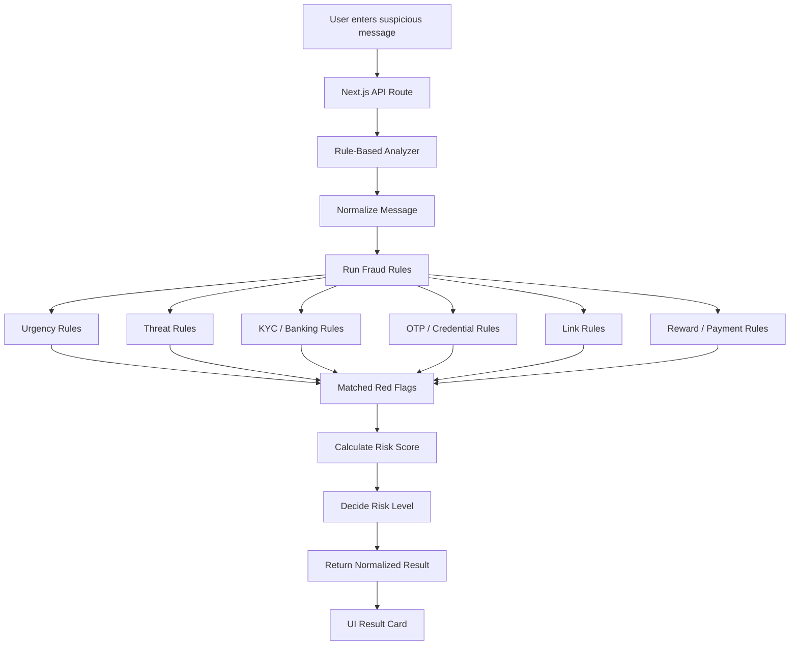

# 00 — Rule-Based Approach

## Overview

The rule-based approach is the simplest and cheapest scam detection method in this project.

It does not use OpenAI, local LLMs, or a machine learning model.

Instead, it uses manually written fraud detection rules to identify common scam signals such as:

- Urgency
- Account blocking threats
- KYC update requests
- OTP / PIN / CVV requests
- Suspicious links
- Fake rewards
- Payment or processing fee requests
- Authority impersonation
- Sensitive data requests

This approach is useful as a baseline because it is fast, explainable, and almost zero-cost.

---

## What This Approach Does

Given a message, the rule-based engine checks whether it contains known scam patterns.

Example input:

```txt
Your bank account will be blocked today. Click this link immediately to update your KYC.
```

Expected output:

```json
{
  "approach": "rule_based",
  "riskLevel": "high",
  "riskScore": 95,
  "confidence": 0.95,
  "scamType": "kyc_phishing",
  "redFlags": [
    "Urgency or time pressure",
    "Account blocking or suspension threat",
    "KYC or banking verification request",
    "Suspicious link or click request"
  ],
  "safeAction": "Do not click any link or share personal details. Contact the official organization through verified channels."
}
```

---

## Architecture



---

## How It Works

The engine follows a simple deterministic flow:

```txt
Input Message
   ↓
Normalize text
   ↓
Check against predefined fraud rules
   ↓
Collect matched red flags
   ↓
Add rule weights
   ↓
Calculate risk score
   ↓
Map score to Low / Medium / High
   ↓
Return explanation and safe action
```

---

## Example Rules

| Rule Category     | Example Signal                        | Why It Matters                                         |
| ----------------- | ------------------------------------- | ------------------------------------------------------ |
| Urgency           | “immediately”, “today”, “act now”     | Scammers create pressure so users act without thinking |
| Account threat    | “account blocked”, “card suspended”   | Fear-based manipulation                                |
| KYC / banking     | “update KYC”, “verify account”        | Common phishing pattern                                |
| OTP / credentials | “share OTP”, “send PIN”, “CVV”        | Attempts to steal sensitive credentials                |
| Suspicious link   | `http://`, short links, “click here”  | Link-based phishing                                    |
| Fake reward       | “you won”, “claim prize”              | Too-good-to-be-true lure                               |
| Payment request   | “processing fee”, “registration fee”  | Advance-fee fraud                                      |
| Impersonation     | “bank”, “RBI”, “police”, “income tax” | Trusted authority abuse                                |

---

## Risk Scoring

Each rule has a weight.

Example:

```txt
Urgency detected = +15
KYC request = +25
Suspicious link = +30
Account blocking threat = +25
```

Final score:

```txt
15 + 25 + 30 + 25 = 95
```

Risk mapping:

| Score Range | Risk Level |
| ----------: | ---------- |
|        0–34 | Low        |
|       35–69 | Medium     |
|      70–100 | High       |

---

## Benefits

| Benefit                  | Explanation                                        |
| ------------------------ | -------------------------------------------------- |
| Zero API cost            | No OpenAI or external model call                   |
| Very fast                | Runs with simple code checks                       |
| Easy to explain          | Every result can be traced back to matched rules   |
| Low infrastructure       | No GPU, no vector DB, no model hosting             |
| Good baseline            | Useful for comparing against ML and LLM approaches |
| Reliable for known scams | Works well when scam patterns are obvious          |

---

## Drawbacks

| Drawback                 | Explanation                                           |
| ------------------------ | ----------------------------------------------------- |
| Limited flexibility      | Can miss new scam wording                             |
| Manual maintenance       | Rules need regular updates                            |
| No deep reasoning        | Cannot understand complex intent like an LLM          |
| False positives possible | Safe banking/payment messages may match scam keywords |
| Not enough alone         | Real-world scams evolve quickly                       |

---

## What We Learn

This approach teaches core engineering foundations before using AI models:

- Fraud pattern detection
- Rule design
- Regex-based text matching
- Risk scoring
- Confidence calculation
- Explainable decision-making
- False positive / false negative thinking
- Baseline comparison against ML and LLM approaches
- Cost-effective architecture design

---

## When This Approach Is Best

Rule-based detection is useful when:

- Cost must be zero
- Speed is important
- Patterns are known
- Explanation is required
- We need a first-level filter before calling an LLM
- We want a simple baseline for comparison

---

## When This Approach Is Not Best

Rule-based detection is not ideal when:

- Messages are ambiguous
- Scam wording keeps changing
- We need natural language reasoning
- We want high coverage across unknown scam types
- We need adaptive learning from data

---

## Role in This Project

In this project, the rule-based engine acts as the foundation.

It helps answer:

```txt
How far can we go without AI?
```

Then we compare it with:

- Traditional ML
- OpenAI LLM
- Local LLM
- Hybrid engine

This makes the project stronger because it shows that AI should not be used blindly.
A good AI system often combines simple deterministic logic with model-based reasoning.

---

## Implementation Files

```txt
src/services/rule-based-analyzer/
├── ruleBasedAnalyzer.ts
├── ruleBasedRules.ts
└── ruleBasedTypes.ts
```

| File                   | Purpose                                   |
| ---------------------- | ----------------------------------------- |
| `ruleBasedRules.ts`    | Contains scam detection rules and weights |
| `ruleBasedAnalyzer.ts` | Runs the rules and calculates final risk  |
| `ruleBasedTypes.ts`    | Defines TypeScript types for the result   |

---

## Final Summary

The rule-based approach is not the most intelligent approach, but it is the most cost-effective and explainable baseline.

It proves one important point:

```txt
Before using an LLM, understand what can be solved with simple deterministic logic.
```

That makes the later OpenAI, local LLM, ML, and hybrid comparisons more meaningful.
