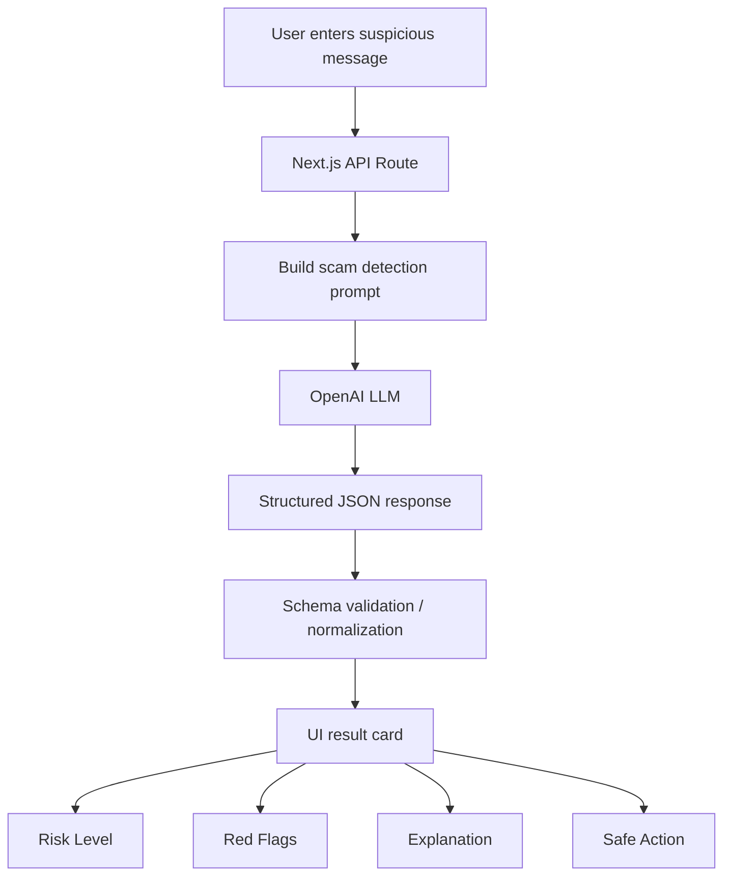

# 01 — OpenAI LLM Approach

## Overview

This approach uses a hosted Large Language Model through the OpenAI API to analyze suspicious messages.

The goal is not only to classify a message as safe or scam, but also to explain why it is risky in simple language.

## What This Approach Does

Given an SMS, email, WhatsApp message, or suspicious text, the OpenAI LLM analyzes:

- Risk level
- Scam type
- Red flags
- Explanation
- Safe action
- Confidence score

Example input:

```txt
Your bank account will be blocked today. Click this link immediately to update your KYC.
```

Expected output:

```json
{
  "riskLevel": "high",
  "scamType": "kyc_phishing",
  "redFlags": [
    "Urgency",
    "Bank account blocking threat",
    "KYC update request",
    "Suspicious link"
  ],
  "safeAction": "Do not click the link. Contact the bank directly through official channels."
}
```

---

## Architecture



---

## How It Works

1. User enters a suspicious message.
2. API builds a fraud detection prompt.
3. OpenAI LLM analyzes the message.
4. The response is expected in structured JSON.
5. The app validates and normalizes the output.
6. UI shows risk level, explanation, red flags, and safe action.

---

## Benefits

| Benefit                       | Explanation                                                    |
| ----------------------------- | -------------------------------------------------------------- |
| Strong language understanding | Can understand different wording, tone, and intent             |
| Good explanations             | Can explain risk in user-friendly language                     |
| Fast to build                 | No training dataset required                                   |
| Flexible                      | Can detect new scam styles without manually writing every rule |
| Useful for GenAI learning     | Teaches prompting, structured output, and validation           |

---

## Drawbacks

| Drawback                   | Explanation                                |
| -------------------------- | ------------------------------------------ |
| API cost                   | Every request has a cost                   |
| External dependency        | Requires OpenAI API availability           |
| Output inconsistency       | LLM may sometimes return unexpected format |
| Needs validation           | JSON output should always be validated     |
| Data privacy consideration | User input is sent to an external API      |

---

## What We Learn

This approach teaches core applied GenAI engineering concepts:

* Prompt engineering
* LLM-based classification
* Intent extraction
* Structured JSON output
* Schema validation
* Hallucination control
* Safe response design
* Explainable AI
* API-based AI integration

---

## When This Approach Is Best

This approach is best when:

* We need high-quality explanation
* We do not have a labelled dataset
* We want to build a working prototype quickly
* The input can be complex or ambiguous
* Reasoning quality is more important than lowest cost

---

## When This Approach Is Not Best

This approach is not ideal when:

* Cost must be near zero
* Offline/local processing is required
* Data cannot be sent to external APIs
* Extremely low latency is required
* We need full control over the model
