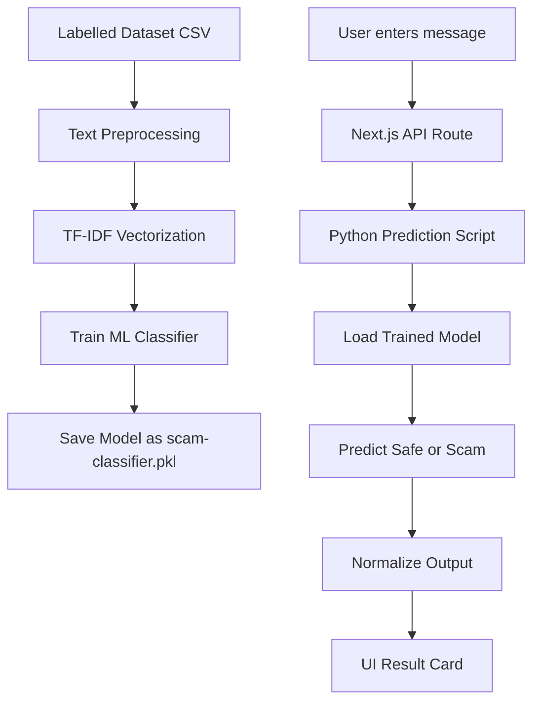
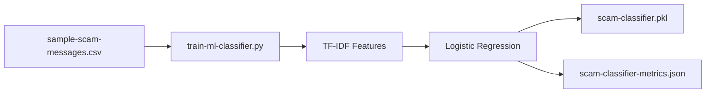
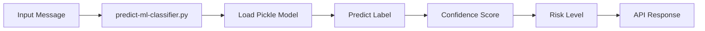

# 02 — Traditional ML Approach

## Overview

This approach detects scam messages using a traditional machine learning classifier.

Unlike the OpenAI LLM approach, this does not call any LLM during prediction.

The current implementation uses:

```txt
TF-IDF + Logistic Regression
```

The model is trained on labelled scam and safe messages.

---

## What This Approach Does

The ML classifier predicts whether a message is:

* Scam
* Safe

Then the system converts the prediction into:

* Risk level
* Risk score
* Confidence
* Scam type
* Red flags
* Safe action

---

## Architecture



---

## Training Flow



---

## Prediction Flow



---

## Benefits

| Benefit               | Explanation                                         |
| --------------------- | --------------------------------------------------- |
| Very low runtime cost | No API call is required                             |
| Fast prediction       | Lightweight model runs quickly on CPU               |
| Works offline         | Does not depend on OpenAI or local LLM              |
| Easy to evaluate      | Accuracy, precision, recall, and F1 can be measured |
| Good ML learning      | Teaches dataset preparation and model training      |

---

## Drawbacks

| Drawback             | Explanation                                          |
| -------------------- | ---------------------------------------------------- |
| Needs labelled data  | Model quality depends heavily on dataset quality     |
| Limited reasoning    | Cannot explain like an LLM                           |
| Less flexible        | May fail on new scam patterns not seen in training   |
| Maintenance required | Needs retraining with new data                       |
| Basic explanations   | Explanations are rule-assisted, not deeply generated |

---

## What We Learn

This approach teaches traditional ML concepts:

* Dataset preparation
* Labelled training data
* Text preprocessing
* TF-IDF vectorization
* Logistic Regression classifier
* Train/test split
* Accuracy, precision, recall, F1 score
* False positive and false negative analysis
* Model persistence using pickle/joblib
* Calling Python ML from a web application

---

## Why Accuracy May Be Low Initially

If the dataset is small, the model may show low accuracy.

Common reasons:

* Too few training examples
* Not enough scam categories
* Not enough safe examples
* Lack of hard-safe examples
* Imbalanced dataset
* Similar wording across records

For scam detection, accuracy alone is not enough.

Important metrics:

| Metric           | Why It Matters                              |
| ---------------- | ------------------------------------------- |
| Precision        | Avoid wrongly marking safe messages as scam |
| Recall           | Avoid missing real scam messages            |
| F1 Score         | Balance between precision and recall        |
| Confusion Matrix | Shows false positives and false negatives   |

---

## When This Approach Is Best

This approach is best when:

* Cost must be low
* Prediction must be fast
* A labelled dataset is available
* We need measurable model performance
* The scam patterns are relatively stable

---

## When This Approach Is Not Best

This approach is not ideal when:

* There is no labelled dataset
* The message is complex or ambiguous
* We need strong natural language explanation
* Scam patterns change frequently
* User-facing explanation quality is important
