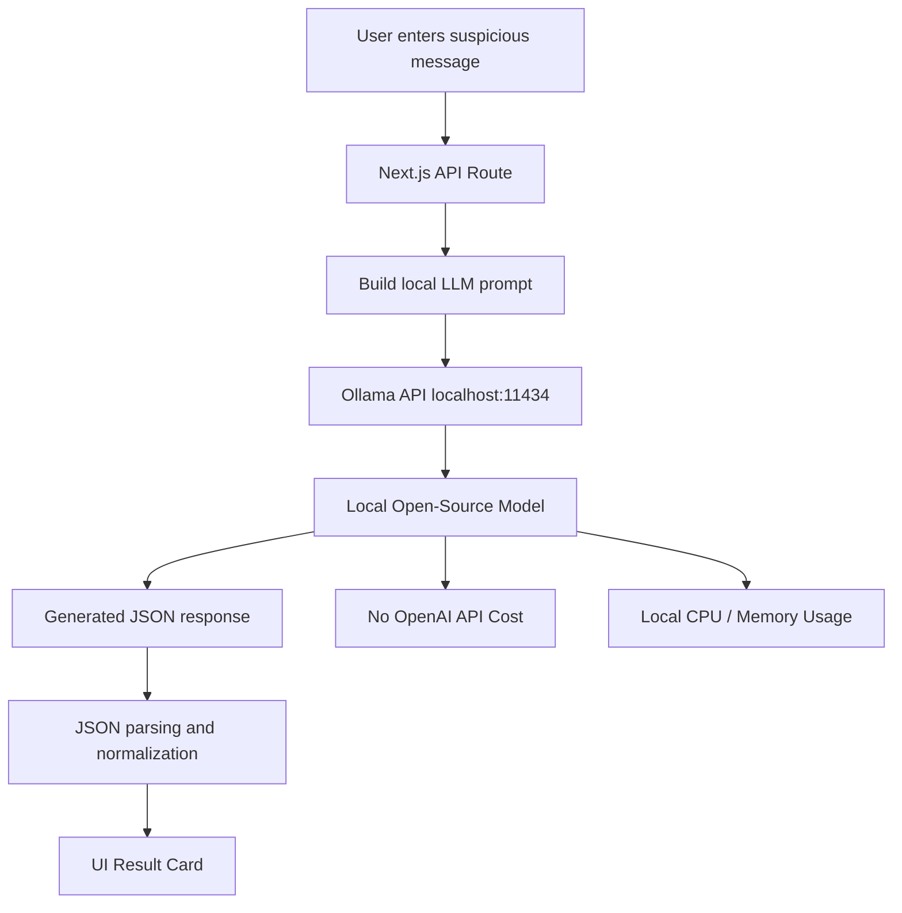
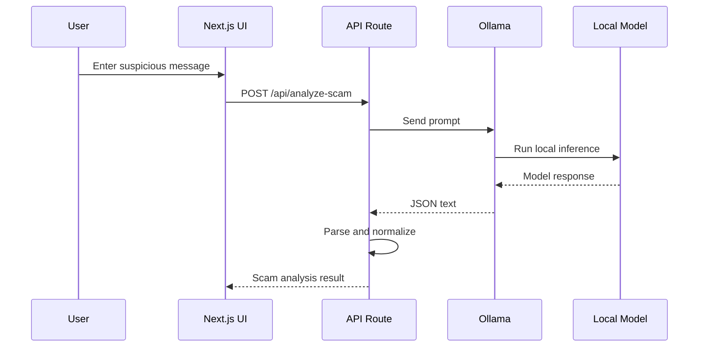

# 03 — Local LLM Approach

## Overview

This approach uses an open-source Large Language Model running locally through Ollama.

Instead of sending the message to OpenAI, the app sends it to a local model such as:

- Llama
- Phi
- Mistral
- Qwen
- Gemma

This helps compare hosted LLMs with local LLMs.

---

## What This Approach Does

The local LLM analyzes a suspicious message and returns structured output:

- Risk level
- Risk score
- Scam type
- Red flags
- Explanation
- Safe action
- Confidence

---

## Architecture



---

## Runtime Flow



---

## Benefits

| Benefit             | Explanation                                           |
| ------------------- | ----------------------------------------------------- |
| No OpenAI API cost  | Runs locally after model download                     |
| Better privacy      | Message does not leave local machine                  |
| Good learning value | Teaches local model serving and inference             |
| More control        | Can choose and compare models                         |
| Offline possibility | Can work without external API once model is available |

---

## Drawbacks

| Drawback                | Explanation                                            |
| ----------------------- | ------------------------------------------------------ |
| Higher local infra need | Requires CPU/RAM and possibly GPU                      |
| Slower response         | Local inference may be slower than hosted APIs         |
| Output reliability      | Local models may not always return clean JSON          |
| Setup required          | User must install Ollama and pull a model              |
| Quality varies          | Smaller models may be less accurate than hosted models |

---

## What We Learn

This approach teaches:

* Local LLM setup
* Ollama integration
* Open-source model usage
* Local inference
* Prompting smaller models
* JSON extraction and fallback handling
* CPU and memory trade-offs
* Model quality comparison
* Privacy vs performance trade-off

---

## Environment Variables

```env
OLLAMA_BASE_URL=http://localhost:11434
OLLAMA_MODEL=llama3.2
```

---

## How to Run Ollama

Install Ollama and pull a model:

```bash
ollama pull llama3.2
```

Start Ollama if needed:

```bash
ollama serve
```

Check running models:

```bash
curl http://localhost:11434/api/tags
```

---

## When This Approach Is Best

This approach is best when:

* API cost must be avoided
* Local/private processing is important
* We want to compare open-source models
* The project is focused on infra and model deployment learning
* Internet/API dependency should be reduced

---

## When This Approach Is Not Best

This approach is not ideal when:

* The machine has low RAM/CPU
* Very fast response is required
* The model struggles with structured JSON
* Hosted model quality is required
* Setup should be simple for all users
