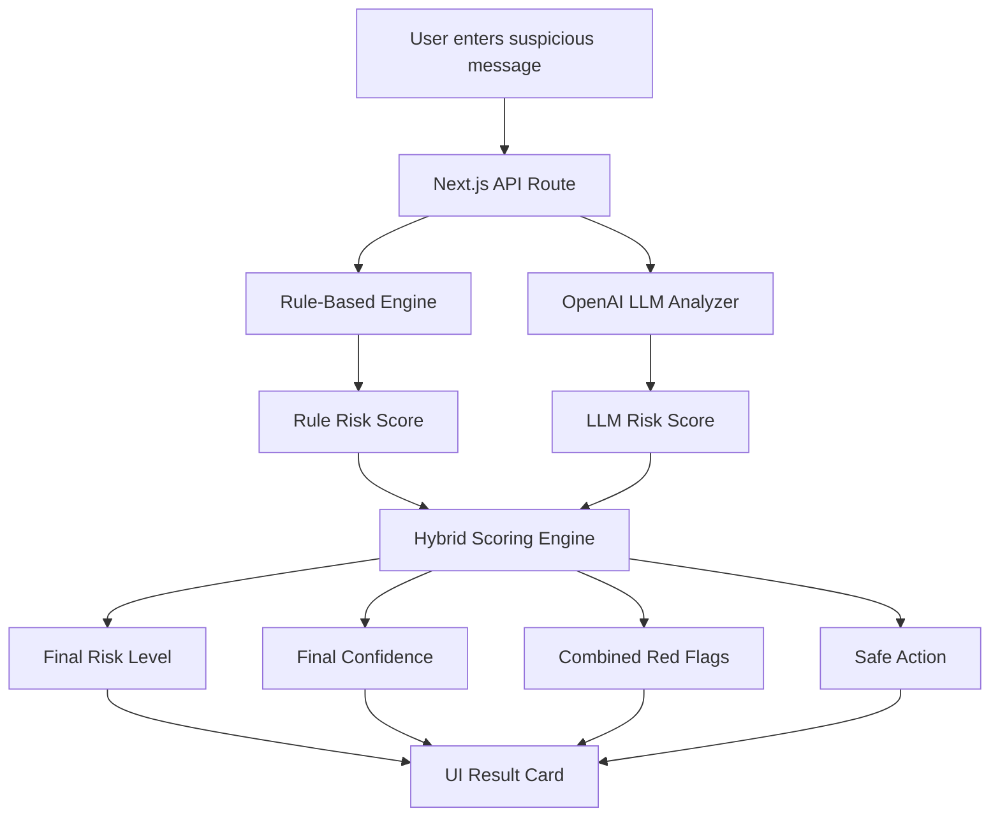
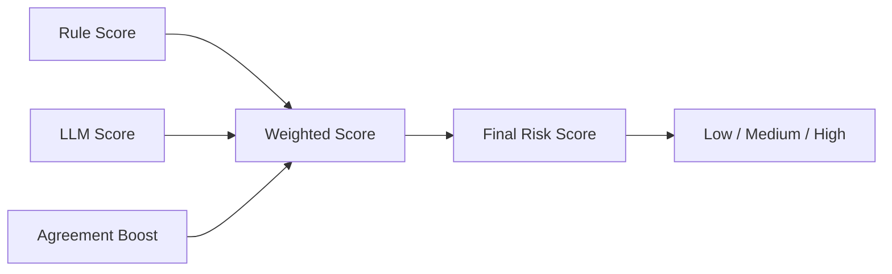

# 04 — Hybrid Approach

## Overview

The hybrid approach combines multiple detection methods to make the final decision.

Instead of depending on only one model or one rule system, it combines:

- Rule-based fraud signals
- LLM reasoning
- Structured validation
- Final scoring logic

This is the closest approach to a production-style AI system.

---

## What This Approach Does

The hybrid engine analyzes a message using more than one strategy.

Current implementation:

```txt
Rule-Based Engine + OpenAI LLM + Scoring Logic
```

Future extension:

```txt
Rule-Based Engine + ML Classifier + OpenAI / Local LLM + Scoring Logic
```

---

## Architecture



---

## Hybrid Scoring Flow



---

## Why Hybrid?

A single approach has limitations.

| Approach      | Limitation                           |
| ------------- | ------------------------------------ |
| Rule-based    | Misses new wording                   |
| ML classifier | Needs good labelled data             |
| OpenAI LLM    | Has API cost and external dependency |
| Local LLM     | Needs local infra and may be slower  |

Hybrid combines strengths:

| Component  | Strength                              |
| ---------- | ------------------------------------- |
| Rules      | Fast, cheap, deterministic            |
| LLM        | Strong reasoning and explanation      |
| Validation | Consistent output                     |
| Scoring    | Final control remains with the system |

---

## Benefits

| Benefit                 | Explanation                               |
| ----------------------- | ----------------------------------------- |
| Better reliability      | Does not depend only on one model         |
| Strong explainability   | Combines rule signals and LLM explanation |
| Cost control            | Rules can handle obvious cases            |
| Flexible architecture   | ML/local LLM can be added later           |
| Production-style design | Similar to real-world AI system design    |

---

## Drawbacks

| Drawback                          | Explanation                                 |
| --------------------------------- | ------------------------------------------- |
| More complex than single approach | Multiple engines need orchestration         |
| Needs normalization               | All engines must return common output shape |
| Slightly higher latency           | Multiple checks may run together            |
| Requires scoring strategy         | Weighting needs tuning                      |
| More testing required             | Must test disagreement between engines      |

---

## What We Learn

This approach teaches senior applied AI engineering concepts:

* Hybrid AI system design
* Rule + LLM orchestration
* Risk scoring
* Confidence scoring
* Output normalization
* Explainability design
* Cost-aware routing
* Trust and safety thinking
* Comparing model-based and deterministic systems
* Designing around the model, not just calling the model

---

## Example Decision Logic

```txt
If rules detect OTP sharing + suspicious link:
    increase risk strongly

If LLM also detects phishing intent:
    boost confidence

If rule engine says medium but LLM says high:
    final result may become high

If both engines agree:
    confidence increases
```

---

## When This Approach Is Best

This approach is best when:

* We want better reliability
* Explainability matters
* Cost needs to be controlled
* We want a production-style architecture
* Different approaches should be compared
* Final decision should remain under system control

---

## When This Approach Is Not Best

This approach is not ideal when:

* We need the simplest prototype
* We want the lowest latency
* We do not want multiple dependencies
* We do not have time to test scoring logic
